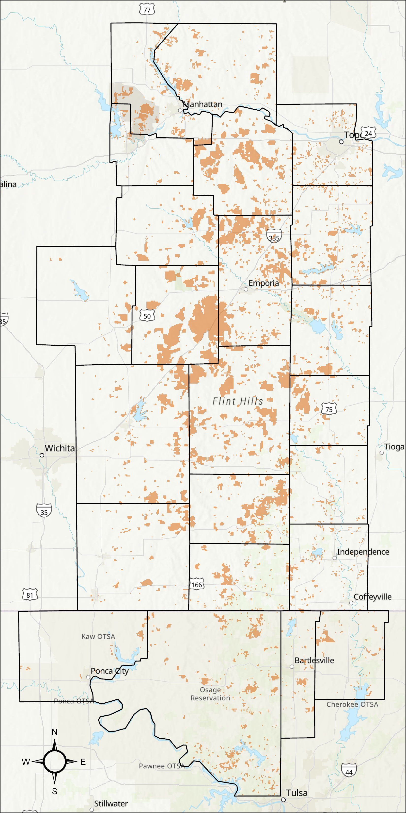
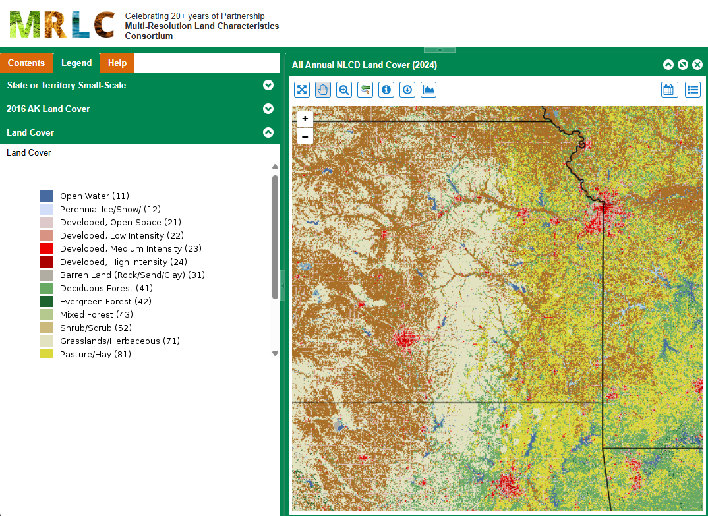

# FHBA (Flint Hills Burned Area Tool)

## About

Placeholder



#### Features

Placeholder


<hr>

## Launch Instructions

> Make sure to follow the __First Time Setup__ steps included below before running the application

Launch the server with

```shell
# include the --show flag to automatically open in the default browser
panel serve .\src\fhba\app\app.py --show
```

<hr>

## Change Log

Placeholder

<hr>

## First Time Setup

### 1. Python environment setup

> For ease of use, this project relies on `uv` for python environment management. See the `uv` User's Guide for __[Installation Instructions](https://docs.astral.sh/uv/getting-started/installation/#installing-uv)__ via `pip`.

Run `uv sync` from to install the necessary third-party packages into a `.venv` within the project directory:

```shell
# From the same directory with the uv.lock and pyproject.toml file...
uv sync
```

### 2. Configuration Settings

__Bounding Box:__ The default bounding box of `[97.75W, 39.75N, 95.25W, 35.75N]` is set in the `src\fhba\config.yaml` file, but this can be changed if desired.


### 3. Land cover mask


> *If you would like to use the NLCD from a different year instead of the default 2024 file:*
> 1. Download the Annual Land Cover Database for a recent year from the __[Multi Resolution Land Characteristics (MRLC) Consortium](https://www.mrlc.gov/data)__. Unzip the download into ./fhba/src/fhba/app/appdata/annual_nlcd
> 2. Update the application config file to point to the correct NLCD file (e.g., update `nlcd_filename` to have the correct year in the filename)
> 3. Execute the python script (e.g., `uv run /fhba/process_landcover_mask.py`) as above.


This tool relies on a landcover mased derived from the __[USGS National Land Cover Database](https://www.usgs.gov/centers/eros/science/national-land-cover-database)__. As seen in the image below, the Flint Hills primarily consists of NLCD categories __71 (Grasslands/Herbaceous)__ and __81 (Pasture/Hay)__. A recent version of the NLCD (Annual Land cover for 2024) is included in the repository via __[Git Large File Storage](https://docs.github.com/en/repositories/working-with-files/managing-large-files/about-git-large-file-storage)__, and should be automatically downloaded locally when the repository is cloned. 



The included `fhba/process_landcover_mask.py` script generates an appropriate landcover mask based on the bounding box specified in the `config.yaml` file so that only pixels coincident with these two NLCD categories are considered to have the potential to burn. 

Execute the script with:

```shell
uv run ./src/fhba/process_landcover_mask.py
```

<hr>

## License

<hr>